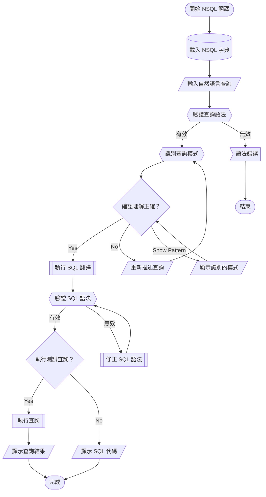

# 🔄 WF003: NSQL Query Translation

## 🎯 Purpose
Translate natural language queries to SQL using NSQL Language framework.

## 📋 Prerequisites
- NSQL dictionary loaded (`dictionary.yaml`)
- Target database connection available
- Understanding of data schema

## 📊 Workflow Overview



## 🚀 Steps

### Step 1: Initialize NSQL Environment
**AI Action**: Load NSQL dictionary and validate environment

```r
source("sc_nsql_dictionary.R")
source("sc_nsql_translate.R")
```

### Step 2: Parse Natural Language Input
**❓ ASK_USER**: 
請輸入您的自然語言查詢
例如：「顯示所有客戶的銷售總額，按地區分組」

**⚡ AI_RESPONSE_LOGIC**:
- Parse query using NSQL grammar
- Identify key patterns and entities
- Validate against dictionary.yaml

### Step 3: Pattern Recognition
**AI Action**: Identify query patterns from examples/

**❓ ASK_USER**: 
我理解您要查詢：{identified_pattern}
這樣理解正確嗎？

**⚡ AI_RESPONSE_LOGIC**:
- "正確" → Continue to SQL translation
- "不對" → Ask for clarification
- "顯示模式" → Show identified patterns and entities

### Step 4: SQL Translation
**AI Action**: Execute translation using sc_nsql_translate.R

```r
translated_sql <- nsql_translate(natural_query, target = "sql")
```

### Step 5: Validation and Testing
**❓ ASK_USER**: 
生成的 SQL 查詢：
```sql
{generated_sql}
```
是否要執行測試查詢？

**⚡ AI_RESPONSE_LOGIC**:
- "執行" → Execute query with LIMIT 10
- "不要" → Show SQL only
- "修改" → Allow manual SQL editing

## ✅ Verification
- [ ] Natural language query parsed successfully
- [ ] Pattern recognition accurate
- [ ] SQL syntax valid
- [ ] Query results meaningful
- [ ] Performance acceptable

## 🔗 Related Workflows
- **Prerequisite**: Database connection established
- **Next step**: WF004 for complex query optimization
- **Related**: WF005 for extension development

## 📚 Key Files Used
- `dictionary.yaml` - NSQL vocabulary
- `sc_nsql_translate.R` - Translation engine
- `examples/` - Query pattern examples
- `grammar.ebnf` - NSQL syntax rules