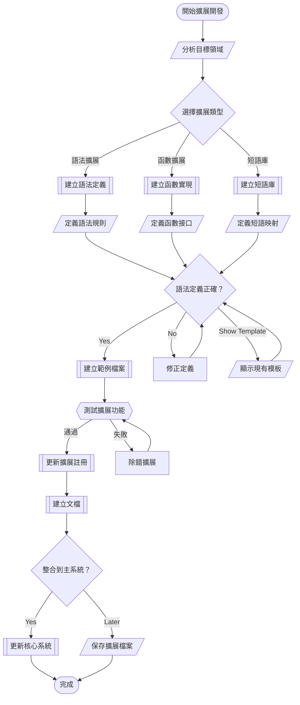

# 🔄 WF004: NSQL Extension Development

## 🎯 Purpose
Develop and integrate new NSQL language extensions for domain-specific functionality.

## 📋 Prerequisites
- Understanding of NSQL grammar and syntax
- Access to `extensions/` directory
- Target domain knowledge (e.g., database documentation, graph theory)

## 📊 Workflow Overview



## 🚀 Steps

### Step 1: Domain Analysis
**❓ ASK_USER**: 
您要開發哪種類型的 NSQL 擴展？
1. 語法擴展 (新的語法規則)
2. 函數擴展 (新的處理函數)
3. 短語庫擴展 (新的短語映射)
4. 專業領域擴展 (特定領域語言)

**⚡ AI_RESPONSE_LOGIC**:
- "語法" → Guide to syntax extension development
- "函數" → Guide to function extension development
- "短語" → Guide to phrase registry development
- "領域" → Show existing domain extensions

### Step 2: Choose Extension Template
**AI Action**: Based on user choice, show relevant templates from `extensions/`

**Available Templates**:
- `implementation_syntax.md` - Implementation patterns
- `table_creation_syntax.md` - Database operations
- `graph_representation_syntax.md` - Graph theory extensions
- `documentation_syntax/` - Documentation generation

### Step 3: Define Extension Specification
**❓ ASK_USER**: 
基於您選擇的模板，請描述具體的擴展需求：
- 目標功能是什麼？
- 需要哪些新的語法元素？
- 預期的輸入和輸出格式？

**⚡ AI_RESPONSE_LOGIC**:
- Create specification document
- Generate syntax definition
- Define function interfaces
- Plan integration points

### Step 4: Implementation
**AI Action**: Generate extension files based on specification

```r
# Create syntax file
cat("Extension syntax definition", file = "extensions/new_extension_syntax.md")

# Create implementation file  
cat("Extension R functions", file = "extensions/new_extension.R")

# Create phrase registry
cat("Extension phrases", file = "extensions/implementation_registry_new.csv")
```

### Step 5: Testing and Validation
**❓ ASK_USER**: 
擴展已建立，要進行測試嗎？
- 語法驗證測試
- 功能邏輯測試  
- 整合測試

**⚡ AI_RESPONSE_LOGIC**:
- "語法" → Run syntax validation tests
- "功能" → Execute function tests with examples
- "整合" → Test with existing NSQL examples
- "跳過" → Move to documentation

### Step 6: Documentation and Integration
**AI Action**: Create comprehensive documentation

**❓ ASK_USER**: 
是否要將擴展整合到主 NSQL 系統？

**⚡ AI_RESPONSE_LOGIC**:
- "是" → Update core grammar.ebnf and dictionary.yaml
- "否" → Save as standalone extension
- "稍後" → Create integration checklist

## ✅ Verification
- [ ] Extension syntax properly defined
- [ ] Function implementation working
- [ ] Test cases passing
- [ ] Documentation complete
- [ ] Integration successful

## 🔗 Related Workflows
- **Prerequisite**: WF003 for understanding NSQL basics
- **Follows**: Extension testing and deployment
- **Related**: Core NSQL system updates

## 📚 Key Files Created
- `extensions/{name}_syntax.md` - Syntax definition
- `extensions/{name}_extension.R` - Implementation
- `extensions/implementation_registry_{name}.csv` - Phrase mappings
- `examples/{name}_examples.nsql` - Usage examples

## 🔧 Integration Points
- Update `grammar.ebnf` with new syntax rules
- Add phrases to `dictionary.yaml`
- Register extension in `extensions/README.md`
- Create test cases in appropriate directories